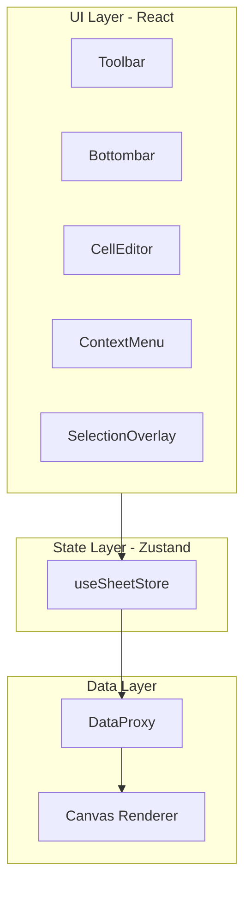

# @tachybase/sheet - React + Canvas 电子表格组件

一个基于 React 和 Canvas 的高性能电子表格组件，结合了 React 的声明式 UI 和 Canvas 的高性能渲染。

## ✨ 特点

- 🚀 **高性能**：Canvas 渲染表格内容，流畅处理大量数据
- ⚛️ **React 生态**：使用 React 管理 UI 组件和状态
- 🎯 **TypeScript**：完整的类型定义，优秀的开发体验
- 🔧 **可扩展**：清晰的架构，易于定制和扩展
- 📦 **轻量级**：合理的包大小，快速加载

## 🏗️ 核心架构

### 架构图



### 技术栈

- **UI 框架**: React 18+
- **状态管理**: Zustand
- **渲染引擎**: Canvas API
- **类型系统**: TypeScript
- **包管理**: pnpm
- **代码质量**: Biome
- **测试**: Vitest
- **构建工具**: Rslib

### 设计理念

#### 1. 分层架构

- **UI 层**：React 组件（Toolbar、Editor、ContextMenu 等）
- **状态层**：Zustand Store（集中状态管理）
- **数据层**：DataProxy（数据操作）+ Canvas（渲染）

#### 2. 职责分离

- **React**：仅负责控件 UI（工具栏、编辑器、菜单）
- **Canvas**：负责高性能表格内容渲染
- **Zustand**：管理应用状态，连接 UI 和数据

#### 3. 性能优化

- Canvas 渲染核心内容，避免大量 DOM 操作
- Zustand 精确更新，减少不必要的重渲染
- 虚拟滚动，仅渲染可见区域

#### 4. 类型安全

- 完整的 TypeScript 类型定义
- 避免 any 类型，提供良好的开发体验
- 所有类型统一定义在 `src/sheet/types.ts`

### 目录结构

```
src/sheet/
├── canvas/          # Canvas 绘制逻辑
│   ├── draw.ts      # 绘制基础类
│   └── cell_renderer.ts  # 单元格渲染
├── components/      # React 组件
│   ├── CanvasTable.tsx
│   ├── Toolbar/
│   ├── Editor/
│   ├── Selection/
│   ├── Scrollbar/
│   ├── ContextMenu/
│   ├── Bottombar/
│   └── common/
├── core/            # 核心数据逻辑
│   ├── data_proxy.ts
│   ├── cell.ts
│   ├── row.ts
│   ├── col.ts
│   └── ...
├── hooks/           # React Hooks
│   ├── useTableRender.ts
│   ├── useKeyboardShortcuts.ts
│   └── useMouseInteraction.ts
├── store/           # Zustand Store
│   └── useSheetStore.ts
├── types.ts         # TypeScript 类型定义
└── index.ts         # 主入口
```

## 📦 安装

```bash
pnpm install @tachybase/sheet
```

## 🚀 快速开始

### 基础使用

```tsx
import { ReactSheet } from '@tachybase/sheet';

function App() {
  return <ReactSheet />;
}
```

### 配置选项

```tsx
<ReactSheet 
  options={{
    mode: 'edit',        // 'edit' | 'read'
    showToolbar: true,
    showBottomBar: true,
    showGrid: true,
  }} 
/>
```

### 加载数据

```tsx
import { ReactSheet, useSheetStore } from '@tachybase/sheet';

function App() {
  const { loadData } = useSheetStore();

  useEffect(() => {
    loadData([
      {
        name: 'Sheet1',
        rows: {
          0: { cells: { 0: { text: 'A1' }, 1: { text: 'B1' } } },
          1: { cells: { 0: { text: 'A2' }, 1: { text: 'B2' } } },
        },
      },
    ]);
  }, []);

  return <ReactSheet />;
}
```

## 📚 API 文档

### ReactSheet 组件

主要组件，接受 `options` prop。

**Props:**

- `options?: SheetOptions` - 表格配置选项

### useSheetStore Hook

全局状态管理 Hook。

**主要方法:**

- `addSheet()` - 添加新表格
- `deleteSheet(index)` - 删除表格
- `switchSheet(index)` - 切换表格
- `renameSheet(index, name)` - 重命名表格
- `setCellText(ri, ci, text)` - 设置单元格内容
- `setCellStyle(property, value)` - 设置单元格样式
- `setSelection(ri, ci)` - 设置选区
- `startEditing(ri, ci)` - 开始编辑
- `stopEditing()` - 停止编辑
- `undo()` - 撤销
- `redo()` - 重做
- `copy()` - 复制
- `cut()` - 剪切
- `paste()` - 粘贴
- `loadData(data)` - 加载数据
- `getData()` - 获取数据

### 自定义 Hooks

- `useActiveSheet()` - 获取当前活动表格
- `useSelection()` - 获取当前选区
- `useIsEditing()` - 获取编辑状态

## 🛠️ 开发指南

### 环境要求

- Node.js 18+
- pnpm 8+

### 本地开发

```bash
# 安装依赖
pnpm install

# 启动开发服务器
pnpm dev

# 启动 Storybook
pnpm storybook
```

### 代码规范

```bash
# 格式化代码
pnpm format

# 代码检查
pnpm check
```

### 测试

```bash
# 运行测试
pnpm test

# 测试覆盖率
pnpm test -- --coverage
```

### 构建

```bash
pnpm build
```

## 🤝 贡献指南

欢迎贡献！请遵循以下规范：

1. 使用 pnpm 进行包管理
2. 使用 Biome 进行代码格式化和检查
3. 遵循 Conventional Commits 规范
4. 编写单元测试
5. 更新文档

详见 [.cursorrules](.cursorrules) 和 [CODE_OF_CONDUCT.md](CODE_OF_CONDUCT.md)

## 📄 License

MIT

## 🔗 相关链接

- [文档](./docs)
- [Storybook](./stories)
- [更新日志](./ai)
